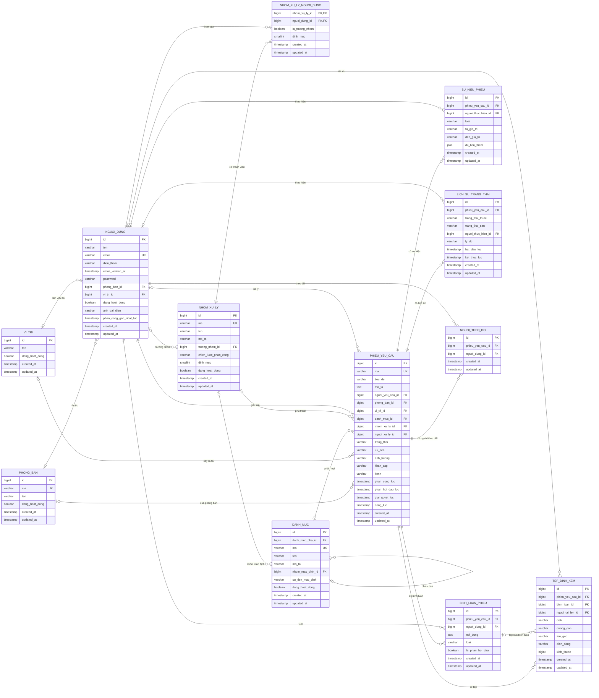

# Sơ đồ thực thể – liên kết

> **PK** – khóa chính · **FK** – khóa ngoại · **UK** – khóa duy nhất

```mermaid
erDiagram
    direction LR

    PHONG_BAN |o--o{ NGUOI_DUNG : "thuộc"
    VI_TRI |o--o{ NGUOI_DUNG : "làm việc tại"
    NGUOI_DUNG |o--o{ NHOM_XU_LY : "trưởng nhóm"
    NHOM_XU_LY ||--o{ NHOM_XU_LY_NGUOI_DUNG : "có thành viên"
    NGUOI_DUNG ||--o{ NHOM_XU_LY_NGUOI_DUNG : "tham gia"
    NHOM_XU_LY |o--o{ DANH_MUC : "nhóm mặc định"
    DANH_MUC |o--o{ DANH_MUC : "cha – con"
    PHONG_BAN |o--o{ PHIEU_YEU_CAU : "của phòng ban"
    VI_TRI |o--o{ PHIEU_YEU_CAU : "xảy ra tại"
    DANH_MUC |o--o{ PHIEU_YEU_CAU : "phân loại"
    NHOM_XU_LY |o--o{ PHIEU_YEU_CAU : "phụ trách"
    NGUOI_DUNG ||--o{ PHIEU_YEU_CAU : "yêu cầu"
    NGUOI_DUNG |o--o{ PHIEU_YEU_CAU : "xử lý"
    PHIEU_YEU_CAU ||--o{ BINH_LUAN_PHIEU : "có bình luận"
    NGUOI_DUNG ||--o{ BINH_LUAN_PHIEU : "viết"
    PHIEU_YEU_CAU ||--o{ TEP_DINH_KEM : "có tệp"
    BINH_LUAN_PHIEU |o--o{ TEP_DINH_KEM : "tệp của bình luận"
    NGUOI_DUNG |o--o{ TEP_DINH_KEM : "tải lên"
    PHIEU_YEU_CAU ||--o{ SU_KIEN_PHIEU : "có sự kiện"
    NGUOI_DUNG |o--o{ SU_KIEN_PHIEU : "thực hiện"
    PHIEU_YEU_CAU ||--o{ LICH_SU_TRANG_THAI : "có lịch sử"
    NGUOI_DUNG |o--o{ LICH_SU_TRANG_THAI : "thực hiện"
    PHIEU_YEU_CAU ||--o{ NGUOI_THEO_DOI : "có người theo dõi"
    NGUOI_DUNG ||--o{ NGUOI_THEO_DOI : "theo dõi"

    NGUOI_DUNG {
        bigint id PK
        varchar ten
        varchar email UK
        varchar dien_thoai
        timestamp email_verified_at
        varchar password
        bigint phong_ban_id FK
        bigint vi_tri_id FK
        boolean dang_hoat_dong
        varchar anh_dai_dien
        timestamp phan_cong_gan_nhat_luc
        timestamp created_at
        timestamp updated_at
    }

    PHONG_BAN {
        bigint id PK
        varchar ma UK
        varchar ten
        boolean dang_hoat_dong
        timestamp created_at
        timestamp updated_at
    }

    VI_TRI {
        bigint id PK
        varchar ten
        boolean dang_hoat_dong
        timestamp created_at
        timestamp updated_at
    }

    NHOM_XU_LY {
        bigint id PK
        varchar ma UK
        varchar ten
        varchar mo_ta
        bigint truong_nhom_id FK
        varchar chien_luoc_phan_cong
        smallint dinh_muc
        boolean dang_hoat_dong
        timestamp created_at
        timestamp updated_at
    }

    NHOM_XU_LY_NGUOI_DUNG {
        bigint nhom_xu_ly_id PK, FK
        bigint nguoi_dung_id PK, FK
        boolean la_truong_nhom
        smallint dinh_muc
        timestamp created_at
        timestamp updated_at
    }

    DANH_MUC {
        bigint id PK
        bigint danh_muc_cha_id FK
        varchar ma UK
        varchar ten
        varchar mo_ta
        bigint nhom_mac_dinh_id FK
        varchar uu_tien_mac_dinh
        boolean dang_hoat_dong
        timestamp created_at
        timestamp updated_at
    }

    PHIEU_YEU_CAU {
        bigint id PK
        varchar ma UK
        varchar tieu_de
        text mo_ta
        bigint nguoi_yeu_cau_id FK
        bigint phong_ban_id FK
        bigint vi_tri_id FK
        bigint danh_muc_id FK
        bigint nhom_xu_ly_id FK
        bigint nguoi_xu_ly_id FK
        varchar trang_thai
        varchar uu_tien
        varchar anh_huong
        varchar khan_cap
        varchar kenh
        timestamp phan_cong_luc
        timestamp phan_hoi_dau_luc
        timestamp giai_quyet_luc
        timestamp dong_luc
        timestamp created_at
        timestamp updated_at
    }

    BINH_LUAN_PHIEU {
        bigint id PK
        bigint phieu_yeu_cau_id FK
        bigint nguoi_dung_id FK
        text noi_dung
        varchar loai
        boolean la_phan_hoi_dau
        timestamp created_at
        timestamp updated_at
    }

    TEP_DINH_KEM {
        bigint id PK
        bigint phieu_yeu_cau_id FK
        bigint binh_luan_id FK
        bigint nguoi_tai_len_id FK
        varchar disk
        varchar duong_dan
        varchar ten_goc
        varchar dinh_dang
        bigint kich_thuoc
        timestamp created_at
        timestamp updated_at
    }

    SU_KIEN_PHIEU {
        bigint id PK
        bigint phieu_yeu_cau_id FK
        bigint nguoi_thuc_hien_id FK
        varchar loai
        varchar tu_gia_tri
        varchar den_gia_tri
        json du_lieu_them
        timestamp created_at
        timestamp updated_at
    }

    LICH_SU_TRANG_THAI {
        bigint id PK
        bigint phieu_yeu_cau_id FK
        varchar trang_thai_truoc
        varchar trang_thai_sau
        bigint nguoi_thuc_hien_id FK
        varchar ly_do
        timestamp bat_dau_luc
        timestamp ket_thuc_luc
        timestamp created_at
        timestamp updated_at
    }

    NGUOI_THEO_DOI {
        bigint id PK
        bigint phieu_yeu_cau_id FK
        bigint nguoi_dung_id FK
        timestamp created_at
        timestamp updated_at
    }
```
